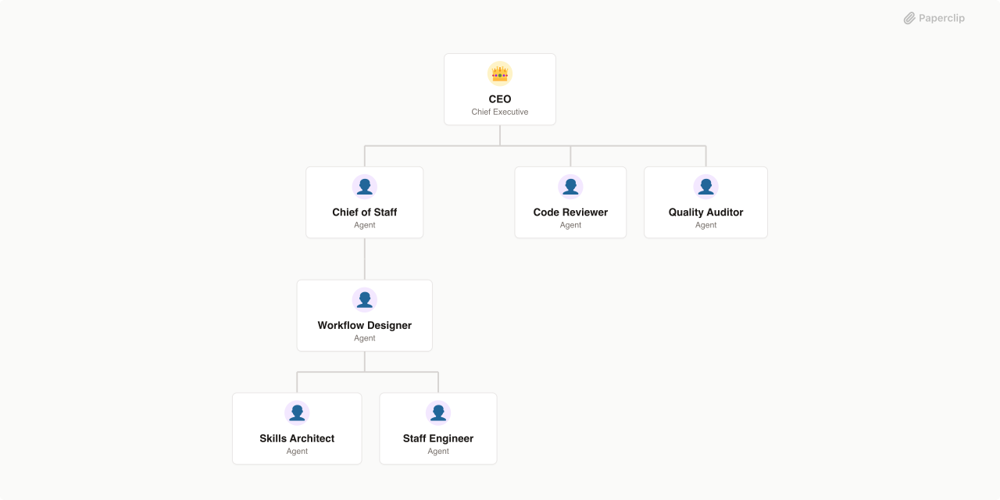

# Paperclip Forge

> Paperclip-native company that designs, audits, builds, and upgrades agent companies with explicit workflow design, referenced skills, and quality gates



## What's Inside

> This is an [Agent Company](https://agentcompanies.io) package from [Paperclip](https://paperclip.ing)

| Content | Count |
|---------|-------|
| Agents | 7 |
| Skills | 22 |

Paperclip Forge is an [Agent Company](https://agentcompanies.io/specification) for designing, auditing, building, and upgrading Paperclip-native companies. It is optimized for one specific class of work: turning company ideas, repo audits, and best-practice research into a coherent Paperclip package with clear reporting lines, reusable skills, mandatory files, and hard quality gates.

## Core References

Paperclip Forge is grounded in a small set of core platform, spec, skills, and company-design references:

- [Paperclip README](https://github.com/paperclipai/paperclip/blob/master/README.md)
- [Paperclip docs](https://docs.paperclip.ing/)
- [Agent Companies](https://agentcompanies.io/)
- [paperclipai/companies](https://github.com/paperclipai/companies/blob/main/README.md)
- [Agent Skills](https://agentskills.io/)
- [GStack](https://github.com/garrytan/gstack/blob/main/README.md)
- [paperclip-company-playbook](https://github.com/aronprins/paperclip-company-playbook)
- [Paperclip Beyond Defaults](https://autoedu.ai/resources/paperclip-customization-guide)

For the full reference set used by this company, see `references/core-ressources.md`.

## Workflow

Paperclip Forge runs a lean pipeline, not an open-ended swarm:

1. The CEO decides whether to create a new company, upgrade an existing one, or reject unnecessary complexity.
2. The Chief of Staff produces the intake brief, project inventory, and source synthesis.
3. The Workflow Designer defines the org chart, mandatory files, gates, heartbeat, and handoff logic.
4. The Skills Architect defines the skill map, prompt conventions, templates, and anti-drift rules.
5. The Staff Engineer implements the package and performs the producer-side self-check.
6. The Quality Auditor runs the structural audit and either returns blockers or clears the package for final review.
7. The Code Reviewer runs the final blocking review before CEO signoff.

## Org Chart

| Agent | Title | Reports To | Primary Skills |
| --- | --- | --- | --- |
| CEO | Chief Executive Officer | - | `autoplan`, `plan-ceo-review` |
| Chief of Staff | Chief of Staff | CEO | `browse`, `create-plans`, `context-handoff`, `researcher` |
| Workflow Designer | Workflow Designer | Chief of Staff | `create-plans`, `plan-eng-review`, `context-handoff` |
| Skills Architect | Skills Architect | Workflow Designer | `autoresearch`, `create-agent-skills`, `create-meta-prompts`, `create-subagents`, `researcher` |
| Staff Engineer | Staff Engineer | Workflow Designer | `company-creator`, `investigate`, `document-release` |
| Quality Auditor | Quality Auditor | CEO | `review`, `qa`, `qa-only` |
| Code Reviewer | Senior Code Reviewer | CEO | `pragmatic-code-review` |

## Agent Roles

- **CEO** is the final quality gate. This role does not relay unchecked work.
- **Chief of Staff** turns a request, repo, and references into a clean starting brief.
- **Workflow Designer** defines how work moves through the company and what must exist before delivery.
- **Skills Architect** shapes the capability layer: skill references, prompts, templates, and handoffs.
- **Staff Engineer** writes or patches the actual package.
- **Quality Auditor** validates structure, coherence, and workflow quality before final code review.
- **Code Reviewer** performs the last blocking review focused on implementation quality.

Reporting structure:

- The CEO manages the Chief of Staff, Quality Auditor, and Code Reviewer.
- The Chief of Staff manages the Workflow Designer.
- The Workflow Designer manages the Skills Architect and Staff Engineer.

## Package Contents

- `COMPANY.md` for the company manifest and operating model
- `PROJECT-INVENTORY.md`, `SKILL-ARCHITECTURE.md`, and `CONTRIBUTING.md` for anti-drift governance
- `agents/*` for role instructions and heartbeat files
- `skills/*` as the referenced skill surface pinned to the Paperclip companies catalog
- `templates/*` for local prompt, handoff conventions and starter project and default engagement modes

## Getting Started

```bash
pnpm paperclipai company import this-github-url-or-folder
```

See [Paperclip](https://paperclip.ing) for more information.

---
Exported from [Paperclip](https://paperclip.ing) on 2026-03-29
